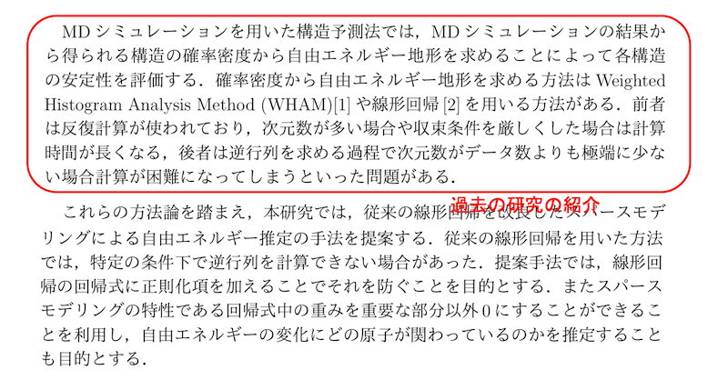

# 修論・卒論の書き方

松永康佑  
ymatsunaga@mail.saitama-u.ac.jp  
2024年11月3日 更新  

---

## 内容

- [論文とは？](#論文とは)
- [修士論文・卒業論文とは？](#修士論文・卒業論文とは)
- [修士論文・卒業論文の書き方](#修士論文・卒業論文の書き方)
- [教員からのフィードバックとスケジュール](#教員からのフィードバックとスケジュール)

# 論文とは？

- 研究者間のコミュニケーションツールとして最も使用されることが多い
- この200年〜300年（？）の間メインのツールとして利用されてきており、「型（構成）」が確立している
- 学術雑誌に投稿して、他の研究者が審査する過程(査読、Peer Review)を経て、採択されたら出版される
- 修士論文・卒業論文の執筆は、このコミュニケーションの基礎(構成やテクニカル文章の書き方)を身につける、知るための良いトレーニング

## なぜ論文を書くか？

- 他の研究者とコミュニケーションするため
  - 他の人がその結果を再現して研究のつづきを行う。研究を深める、etc
- 現在の自分のため
  - 文章にすると思考が深まる
  - 言葉にできない → その研究を理解していない  
  - 文章を書こうとしても最初はまったく浮かばないと思います。その場合は勉強不足なので参考文献を読み込みましょう。
  - 論文(今回は卒論)を頑張って執筆すると、執筆後に研究の理解の深さが比較にならないほど伸びており、自分の研究内容をわかりやすく他人へ説明できるようになっていることに気づく
  - 逆を言えば、それを実感できていなければその程度を卒論を書いたということ
- 将来の自分や同僚・後輩のため
  - 1年くらい経つと自分自身でさえ、研究の詳細を忘れていることが多い。例えば、計算に用いたパラメータなどを確認できる。後輩が研究を引き継ぐ際にも参考になる。

# 修士論文・卒業論文とは？

### 目的

- 一つは高等教育の最終仕上げのため。一つは「情報工学特別研究I・II」や「卒業研究」単位の取得。修士研究・卒業研究を行ってきたことを証明するとともに、研究の過程で幅広く学んだということをアピールして、審査の上で単位取得

- 前述の普通の論文では結果が全てであるが、修士研究・卒業論文は結果よりもプロセスが重要。研究のプロセスに則って研究をしてきたか？論文の型に従って原稿が書けているか？を審査の上で単位取得

### 形式

- 基本的には普通の学術論文と同じ構成だが、専門的内容がすぐに始まる学術論文(paper)とは異なり、卒業論文(thesis)は審査が目的であるため、自分の勉強してきたことのアピールも含めて教科書のように基礎的な事項から説明を始めて、くどいくらい説明を過剰に書いて良い。基礎的なことから順番を追って説明してもOK

### ページ数制限

- 修士論文・卒業論文はページ数制限なし (普通の論文(paper)はページ数制限あり)

## 修士論文・卒業論文の構成

基本的には普通の論文と同じ構成でよい

1. **概要 (Abstract)**  
   概要はその論文の内容を簡潔に説明したもの。論文では、この概要の文章だけがネットに出回る。世界中の研究者は論文本体ではなくこの概要だけを読むことが多い。したがって概要は最も重要。短い時間で内容全体がわかるように自己完結していなければならない。修論・卒論も同じように意識して書く。

2. **イントロダクション (Introduction)**  
   背景知識を説明して、先行研究を紹介しながら、自分の研究が重要であることを読者に納得させる。先行研究における問題点を説明し、それを解決するための提案を説明する。提案の新規性や独創性も説明する。やったこととその結果も説明する。論文の章立てとそれぞれの章の内容を説明する。

3. **方法 (Methods)**  
   数式や図を使用して、手法などを説明する。再現性がとれる情報を書く。普通の論文の場合は過不足のない範囲でコンパクトに書いたほうが良いが、修論・卒論の場合は基礎的なことから説明を始めてくどいくらい過剰に書いても良い。

4. **計算結果と考察 (Results and Discussion)**  
   結果を図を一枚一枚説明しながら、それぞれの結果の自分なりの解釈(どうしてそうなったか)で書いている

5. **おわりに (Concluding Remarks)**  
   今回の研究内容と結果をコンパクトに、また波及効果や今後の展開について書く

## 概要の例

以下、菱沼達也 2019年度埼玉大学卒業論文から抜粋

## イントロダクションの例1

## イントロダクションの例2

## 方法の例1

## 方法の例2

## 結果と考察の例

## おわりにの例

## 参考文献リストと引用の仕方

参考文献リストはPhysical Reviewのスタイルに、タイトルを加えたスタイルで統一しています。以下のように参考文献リストを書きます。

著者名、タイトル、*雑誌名*、**volume**、page、(出版年)

[1] A. Smith and B. Jones, Quantum Phase Transitions in Two-Dimensional Systems, *Phys. Rev. Lett*. **125**, 067001 (2020).

[2] A. Einstein, B. Podolsky, and N. Rosen, Can Quantum-Mechanical Description of Physical Reality Be Considered Complete?, *Phys. Rev.* **47**, 777 (1935).

[3] M. Sato, S. Fujimoto, Y. Tanaka, and K. Yada, Novel Topological Superconducting States, *Phys. Rev. Lett.* **118**, 147001 (2017).

[4] P. W. Anderson, More Is Different, *Science* **177**, 393 (1972).

[5] J. Wang, Y. Li, M. Chen, K. Zhang, and T. Yamamoto, Quantum Control Using Real-Time Feedback, *Phys. Rev. Lett.* **130**, 123601 (2023).

参考文献リストのスタイル
- 著者名：イニシャル + 姓
- 著者が複数：カンマ(,)で区切り、最後の著者の前はand
- タイトルは通常のフォント
- ジャーナル名はイタリックで、略称を使用（*Phys. Rev. Lett.*, *Phys. Rev.* など）
- 略称がわからなければ Google で「雑誌名 abbreviation」で検索する
- 巻数はボールド体
- ページ番号の前にpp.は不要
- 年は括弧内に記載
- 著者が多くなった場合は、筆頭著者のみ書き、et al.とする。何名以上の場合とは定めていないので、適宜判断すること。

文章中の引用の仕方
- 文章中の登場順に番号[1],[2],[3]...を付けて引用すること。

# 卒業論文の書き方

## 執筆手順

1. **図を全て作成する**  
   結果の図だけでなく手法の説明図も含めて全て作成。  
   図を揃えながら、論文全体のストーリーを考える。何を問題とするか？提案手法のユニークな点は？結論は？

2. **修論・卒論テンプレートを取得**  
   自分の研究に近い先輩の修論・卒論をテンプレートとする。先輩の修論・卒論は[以下に置いてある](https://github.com/matsunagalab/thesis)。

3. **資料を集める。読む**  
   引用する論文の資料等をすぐ読める形で整理する。理解が不十分と思っている文献を読んでおく。

4. **各章のタイトル、その章で書くべき内容を箇条書きで書く**  
   各章の先頭にその章で書くべき内容を箇条書きで書き込んでいく

5. **文章を書いていく**  
   最初はまちがいなく全く文章が出てこない。それは勉強不足なことを意味するので、先輩の修士論文・卒論や参考文献を読み直そう。疲れたらタイトル、参考文献、名前などの単純作業を行う。適宜3〜4へ戻る

6. **アブストラクトは最後に書くほうが簡単**  
   最後まで修論・卒論を書いていくと最初の想定から変わっている(最初の想定が浅かったので内容が変わっている)。最終版になってからアブストラクトを書くと良い

## 書くときのポイント

- Wordで執筆すること。(OverLeaf (LaTeX)を使うこともあり得ますが、Wordは他人の編集箇所が確認しやすいので、教員からのフィードバックの際に教育効果が高いのが理由です)
- 最初にクオリティの高い図を全部完成させるのがおすすめ。
- 図を自分の中で説明しながら全体のストーリーを作る。
- ストーリーができたら各章で述べるべきことのアウトラインが作れる。
- 具体的には、まずは各章の節のタイトルを決めよう。節をきめたら、その節の中で述べるべきことを箇条書きで書いていく。その箇条書きがパラグラフライティングのトピックになる。
- パラグラフライティングを心がける。1つのパラグラフあたり1トピック。そのトピックのセンテンスを決めて、なるべくパラグラフの1行目にそのトピックセンテンスを含めた文章を書く。各段落の1行目だけ読んでも論文全体の意味がとれるように書く。
- あとはそれに従って文章を肉付けしていくイメージで、文章を書いていく。

## 書くときのチェックリスト

(卒論)とあるのは卒論向けです。(修論)とあるのは修論向けです。何もないのは両方に当てはまります。

### 内容のチェック

- 日本語のおかしな文章が散見されるので、**必ず校正すること**。最低一度は声に出して読むと良い。
- 概要の文章は自己完結しているか？（その文章だけ読めば全てわかるように書いてあるか？)
- イントロダクションその研究を行うことの重要性が説明されているか？
- イントロダクションで先行研究の紹介や既知の問題点が説明されているか？
- パラグラフライティングで書けているか？1つのパラグラフあたり1トピック。そのトピックのセンテンスを決めて、なるべくパラグラフの1行目にそのトピックセンテンスを含めた文章を書く。各段落の1行目だけ読んでも論文全体の意味がとれるように書く。
- 各パラグラフが適度な量の文章で構成されているか？1つだけの文章から成っていたり、逆にたくさんの文章から成っていないか？
- 図のキャプションは十分な量が書いてあるか？そのキャプションの文章だけで自己完結して図の解釈ができるような情報量が与えられているか？
- 結果で「できなかった」、「無理だった」という文章ばかり書く人がいますが、思考停止せずに、どこまでできて、どこからできなかったのかを、あなたの頭で考えて、整理して記述してください。研究で手を動かしたのならば、何もできなかったはずはないのでは？
- 結果で「できなかった」、「無理だった」という文章ばかり書く人がいますが、結果だけでなく考察を書いてください。考察とはなぜそうなったのかあなたの考えを書きます。なぜできなかったのかを説明してください。卒論・修論は結果が良いか悪いかは重要ではありません、あなたが研究のプロセスを実施したか？学んだ？かが重要です。研究では失敗がほとんどで当たり前です。しかし、そこから何を学んだかか？あなたは思考停止に陥らずに考察できたか？が重要です。
- (修士論文) 外部発表を全て書いてください。PG内の先生方が審査しますが、外部発表は客観的に評価しやすいので良いです。「プレゼンテーション特別演習」の単位取得も兼ねます。

### 体裁のチェック
- 参考文献のフォーマットは正しいか？（毎年できている人がいないので必ずチェックすること）
- [PG/学科で指定されている論文番号](http://www.ics.saitama-u.ac.jp/ICS/student/thesis/)は書いたか？
- 文章の切れ目は、句読点「。、」または全角ピリオドカンマ「．，」で統一しているか？松永研究室では句読点で統一すること。
- 原稿の中で、主語は、「本論文」とすること。「本研究」や「我々は」は使用しないこと。
- (卒論)参考文献は10件以上あるか？ (修論) 参考文献は20件以上あるか？
- (卒論)原稿は15ページ以上あるか？ (修論) 原稿は20ページ以上あるか？
- 「ですます」調ではなく「である」調で書くこと。「〜だったのだ」「〜であるのだ」という叙事的な文章は使用しないこと。「〜と思われる」「〜だろう」という曖昧な表現は使用しないこと。代わりに「〜である」「〜と考えられる」という断定的な文章を使用すること。
- 外国人名のファーストネームとファミリーネームの省略の仕方や順番は統一されているか？
- 数字には必ず単位を付けること。数字と単位の間には半角スペースを入れること。
- 図のx軸y軸のラベルはあるか？大きなフォントで書いてあるか？ラベルに単位は書いてあるか？
- (修論)謝辞に審査委員の先生方が入っているか？（審査委員の先生方はあなたの修論を読みます）

## 集中できない？

- とりあえず簡単な作業から始めてみよう  
  - 事務手続きの処理 (学位申請書の作成など)
  - 関連ファイルの整理
  - 掃除をする
  - 謝辞を書く。各章のタイトルを書く。参考文献を書く。
- ポモドーロ・テクニックを使おう  
  - タイマー25分を設定
  - タイマーが鳴るまで執筆
  - 短い(5分)休憩をする
  - それを2〜4回繰り返したら長め(30分)の休憩  
- 今聴いている音楽(アルバム)が間違っているのでは？  
  - 別のジャンルのアルバムをかけてみましょう

## 書くことを習慣化しよう

- 文章を書くのはとても大変
- 意思の力だけではすぐにくじける
- 一夜漬けではテクニカル文章は書けない
- 習慣の力に頼ろう (執筆を習慣化しよう)
  - 例) 毎日午前中は必ず執筆だけしかしない
- 書く作業に入る前に決まった儀式を行う
  - BGMを流す  
  - コーヒーを淹れる
  - 掃除をする

## 書かない言い訳をつくらない

- 結果の図がない？図がなくても方法の箇所は書けるので、書きながらデータを出そう
- 文章がでてこない？勉強不足なので、文献を揃えて読み込みながら執筆しよう
- とにかく決めた時間は執筆に関連することだけする

## 仲間で励まし合おう

- 修論生・卒研生同士で互いの進捗を共有して励まし合おう
- わからないところや質問しあったり、役に立つ情報を共有しよう

## 数式の入力が難しい？

[Mathpix](https://mathpix.com) に数式画像をWord形式やLaTeXへ変換してもらうと便利  

## 文献管理が大変？参考文献入力が大変？

- 文献管理ソフトを使おう。例えば Zotero, Paperpile  
  - [https://togotv.dbcls.jp/en/20220806.html](https://togotv.dbcls.jp/en/20220806.html)  
  - 教員はZoteroを使っている
  - WORDとも連携して参考文献リストを作成してくれる  

## デュアルモニタのすすめ

- ラップトップPCへ外部モニタをつないで、デュアルモニタ体制にする
- 外部モニタに参考文献を映しながら、本体画面のWordで執筆
- 全員デュアルモニタ(卒研生はモバイルモニタ)が使用できる環境を用意するので、モニタがない人は教えてください

# 教員からのフィードバックとスケジュール

## スケジュール

- 提出〆切: 2月初旬
- 1月から執筆だと非常に大変
- 遅くとも12月から執筆することを勧める

### 原稿への教員からのフィードバックを2回行います

- **12月：対面でのフィードバック1回目**  
  主に図と論文構成を詰める

- **1月：対面でのフィードバック2回目**  
  論文の細かな内容・文章を修正する

もちろん他にも都度細かな相談にも乗ります

## 12月：1回目のフィードバック

### 事前の準備

- 図表を全て作って、論文の構成を考えてきてください
- 具体的には以下を行ってきてください  
  - 図表を作成してWordファイルへ貼り付け
  - 章のタイトルの記入
  - 各章の節のタイトルの記入
  - 各節で書くことを箇条書きで書いてくる (それがパラグラフライティングのトピックになる)

- 例年、期日までになにもできていない人が多くて、私の提案を100％受け入れるだけになることがあります。教育が成立しないので、**必ず一度は自分の頭で考えて作成してください**。

### 当日

- 対面でマンツーマンでおよそ2時間かけてフィードバックします
- 論文の型や、研究内容のストーリー作り、考察の仕方について指導します

## 1月：2回目のフィードバック

### 事前の準備

- 1回目で決まった論文構成やトピックセンテンスにしたがって、それを肉付けするように、自分なりに文章を書いてきてください
- フィードバック日の2〜3日前までに提出をお願いします
- 日本語のおかしな文章が散見されるので**必ず校正してください**。最低一度は声に出して読むと良いです。
- [書くときのチェックリスト](#書くときのチェックリスト)にしたがってチェックした結果を提出してください。
- チェックリストの内容にしたがってチェックしてくれるGPTsを作成したので、そのチェックも受けて修正しておいてください。

### 当日

- 対面でマンツーマンでおよそ2時間かけてフィードバックします
- こちらでチェック・編集してきた編集履歴を、どうしてそう編集したかを説明していきます

