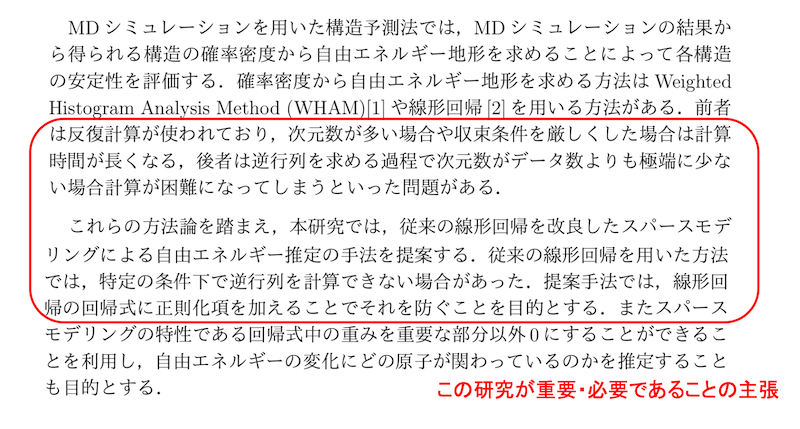
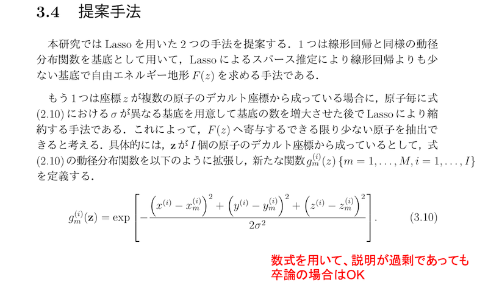
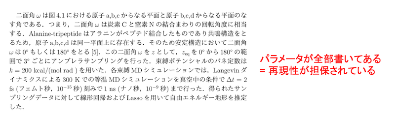
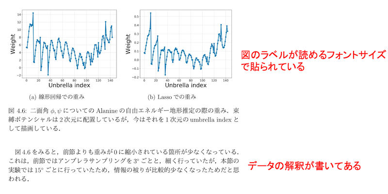

# 卒論の書き方

松永康佑  
ymatsunaga@mail.saitama-u.ac.jp  
2024年11月3日 更新  

---

## 内容

- 論文とは？
- 卒論とは？
- 卒論の書き方
- フィードバックとスケジュール

## 論文とは？

- 研究者間のコミュニケーションツールとして最も使用されることが多い
- この200年〜300年（？）の間メインのツールとして利用されてきており、「型（構成）」が確立している
- 学術雑誌に投稿して、他の研究者が審査する過程(査読、Peer Review)を経て、採択されたら出版される
- 卒業論文の執筆は、このコミュニケーションの基礎(構成やテクニカル文章の書き方)を身につける、知るための良いトレーニング

## なぜ論文を書くか？

- 他の研究者とコミュニケーションするため
  - 他の人がその結果を再現して研究のつづきを行う。研究を深める、etc
- 現在の自分のため
  - 文章にすると思考が深まる
  - 言葉にできない → その研究を理解していない  
  - 文章を書こうとしても最初はまったく浮かばないと思います。その場合は勉強不足なので参考文献を読み込みましょう。
- 論文(今回は卒論)を真面目に執筆をすると、執筆後に研究の理解の深さが比較にならないほど伸びていることや、自分の研究内容を一言で他人へ説明できる能力を獲得したことに気づく
  - 逆を言えば、伸びを実感できていなければその程度を卒論を書いたということ
- 将来の自分や同僚・後輩のため
  - 1年くらい立つと自分自身でさえ、研究の詳細を忘れていることが多い。例えば、計算に用いたパラメータなどを確認できる。

## 卒業論文とは？

### 目的

- 一つは高等教育の最終仕上げのため。一つは「卒業研究」単位の取得。卒業研究を行ってきたことを証明するとともに、卒業研究の過程で幅広く学んだということをアピールして、審査の上で単位取得。

### 形式

- 基本的には普通の学術論文と同じ構成だが、専門的内容がすぐに始まる学術論文(paper)とは異なり、卒業論文(thesis)は審査が目的であるため、自分の勉強してきたことのアピールも含めて教科書のように盛り込んで書いて良い。基礎的なことから順番を追って説明してもOK

### ページ数制限

- なし (普通の論文(paper)はページ数制限あり)

## 卒業論文の構成

基本的には普通の論文と同じ構成でよい

1. **概要 (Abstract)**  
   概要はその論文の内容を簡潔に説明したもの。論文では、この概要の文章だけがネットに出回る。世界中の研究者は論文本体ではなくこの概要だけを読むことが多い。したがって概要は最も重要。短い時間で内容全体がわかるように自己完結していなければならない。卒論も同じように意識して書く。

2. **イントロダクション (Introduction)**  
   背景知識を説明して、先行研究を紹介しながら、自分の研究が重要であることを読者に納得させる。選考研究における問題点を説明し、それを解決するための提案を説明する。やったことと結果も説明する。論文の章立てとそれぞれの章の内容を説明する。

3. **方法 (Methods)**  
   数式や図を使用して、手法などを説明する。再現性がとれる情報を書く。普通の論文の場合は過不足のない範囲でコンパクトに書いたほうが良いが、卒論の場合は過剰に書いても良い。

4. **計算結果と考察 (Results and Discussion)**  
   結果を図を一枚一枚説明しながら、それぞれの結果の自分なりの解釈(どうしてそうなったか)で書いている

5. **おわりに (Concluding Remarks)**  
   今回の研究内容と結果をコンパクトに、また波及効果や今後の展開について書く

## 概要の例

以下、菱沼達也 2019年度埼玉大学卒業論文から抜粋

## イントロダクションの例1

## イントロダクションの例2

## 方法の例1

## 方法の例2

## 結果と考察の例

## おわりにの例

## 文章中の引用の仕方

著者名、タイトル、_雑誌名_、**volume**、page、(出版年)

- 雑誌名はイタリックで、略記名にする  
- 略記名がわからなければ Google で雑誌名と abbreviationで検索する
- 文章中の登場順に番号を付けて引用  

## 大まかな執筆手順

1. **図を全て作成する**  
   結果の図だけでなく手法の説明図も含めて全て作成。  
   図を揃えながら、論文全体のストーリーを考える。何を問題とするか？提案手法のユニークな点は？結論は？

2. **卒論テンプレートを取得**  
   自分の研究に近いOBの卒論をテンプレートとする

3. **資料を集める。読む**  
   引用する論文の資料等をすぐ読める形で整理する。理解が不十分と思っている文献を読んでおく。

4. **各章のタイトル、その章で書くべき内容を箇条書きで書く**  
   各章の先頭にその章で書くべき内容を箇条書きで書き込んでいく

5. **文章を書いていく**  
   最初はまちがいなく全く文章が出てこない。それは勉強不足なことを意味するので、OBの卒論や参考文献を読み直そう。疲れたらタイトル、参考文献、名前などの単純作業を行う。適宜3〜4へ戻る

6. **アブストラクトは最後に書くほうが簡単**  
   最後まで卒論を書いていくと最初の想定から変わっている(最初の想定が浅かったので内容が変わっている)。最終版になってからアブストラクトを書くと良い

## 書くテクニック

- 必ずWordで執筆してください。OverLeaf (LaTeX)を使うこともあり得ますが、Wordは他人の編集箇所が確認しやすいので、教員からのフィードバックの際に教育効果が高いのが理由です
- 最初にクオリティの高い図を全部完成させるのがおすすめ
- 図を自分の中で説明しながら全体のストーリーを作る
- ストーリーができたら各章で述べるべきことのアウトラインが作れる。あとはそれに従って文章を肉付けしていくイメージ
- パラグラフライティング：一段落につき述べるべきことはひとつの話題。段落の最初の文章で述べたいことを書こう

## 集中できない？

- とりあえず簡単な作業から始めてみよう  
  - 謝辞を書く。各章のタイトルを書く。参考文献を書く。
- ポモドーロ・テクニックを使おう  
  - タイマー25分を設定
  - タイマーが鳴るまで執筆
  - 短い(5分)休憩をする
  - それを2〜4回繰り返したら長め(30分)の休憩  
- 今聴いている音楽(アルバム)が間違っているのでは？  
  - 別のアルバムをかけてみましょう

## 書くことを習慣化する

- 文章を書くのはとても大変
- 意思の力だけではすぐにくじける
- 習慣の力に頼る  
  - 例) 毎日午前は執筆だけしかしない
- 一夜漬けではテクニカル文章は書けない
- 書く作業に入る前に決まった儀式を行う
  - BGMを流す  
  - コーヒーを淹れる
  - 掃除をする
- 単純な作業から始めて見る  
  - 事務手続き
  - ファイルの整理

## 書かない言い訳をつくらない

- 結果の図がない？図がなくても方法の箇所は書けるので、書きながらデータを出していきましょう
- 文章がでてこない？勉強不足なので、文献を揃えて読み込みながら執筆しましょう
- とにかく決めた時間は執筆に関連することだけする

## 仲間で励まし合おう

- 卒研生・修論生同士で互いの進捗を共有して励まし合いましょう
- わからないところや質問しあったり、役に立つ情報を共有し合いましょう

## 数式の入力が難しい？

[Mathpix](https://mathpix.com) に数式画像をWord形式やLaTeXへ変換してもらうと便利  

## 文献管理が大変？

- 文献管理ソフトを使おう。例えば Zotero, Paperpile  
  - [https://togotv.dbcls.jp/en/20220806.html](https://togotv.dbcls.jp/en/20220806.html)  
  - WORDとも連携して参考文献リストを作成してくれる  

## デュアルモニタのすすめ

- MacBook Proへ外部モニタをつないで、デュアルモニタ体制にする
- 外部モニタに参考文献を映しながら、本体画面のWordで執筆
- 全員デュアルモニタ(卒研生はモバイルモニタ)が使用できる環境を与えますので、モニタがない人は教えてください

## 教員からのフィードバックとスケジュール

### スケジュール

- 提出〆切: 2月初旬
- 1月から執筆だと非常に大変
- 遅くとも12月から執筆することを勧める

### 執筆指導のための主なフィードバックを2回行います

- **12月：対面でのフィードバック1回目**  
  主に図と論文構成を詰める

- **1月：対面でのフィードバック2回目**  
  論文の細かな内容・文章を詰める

もちろん他にも都度細かな相談にも乗ります

## 12月：1回目のフィードバック

### お願い

- 図表を全て作って、論文の構成を考えてきてください
- 具体的には以下を行ってきてください  
  - 図表を作成してWordファイルへ貼り付け
  - 章のタイトルの記入
  - 各章のパラグラフで書く内容を箇条書きでまとめる

- 例年、期日までになにもできていない人が多くて、私の提案を100％受け入れるだけになることがあります。教育が成立しないので、少なくとも一度は自分の頭で考えて作成してください。

### やること

- 対面でマンツーマンで2時間〜3時間かけてフィードバックします
- 論文の型や、研究内容のストーリー作り、考察の仕方について指導します

## 1月：2回目のフィードバック

### お願い

- 1回目で決まった論文構成にしたがって、それを肉付けするように、自分なりに文章を書いてきてください
- フィードバック日の2〜3日前までに提出をお願いします
- 例年、論文の内容に踏み込めずに、そもそもの日本語を直しているだけで終わってしまうことが多いので、必ず事前に「校正作業」をしてください。最近だとAIなどを使えば手軽に校正することができます(使用する際はOpt-outしてください)。また、声に出して読み上げることもお勧めします。
- 「ですます」調ではなく「である」調で書いてください。といっても「〜だったのだ」とか「〜であるのだ」という文章は避けてください。
- また、体裁の修正だけで終わってしまうことが多いです。特に、論文の引用の仕方は守りましょう。

### やること

- 対面でマンツーマンで2時間〜3時間かけてフィードバックします
- こちらでチェック・編集してきた編集履歴を、どうしてそう編集したかを説明していきます

