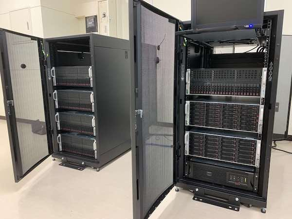

# 研究室サーバの使い方

### 目次

- [ハードウェア情報](#hardware)
- [初期設定](#setup)
- [Jupyterとconda仮想環境](#jupyter)
- [Slurmの使い方](#slurm)



<a id="hardware"></a>
### ハードウェア情報

crabがログインノード兼ファイルサーバ。クラスタへログインする際はcrabが入り口となる。演算ノードへログインすることはほとんどなく、ほとんどの作業をcrab上で行う。crabはメモリ容量大きめ(512GB)なのでデータ解析にも使える。また、Jupyterが常時稼働しており研究室HPのトップページのリンクからとべる。

crabを含めて、crabのネットワークに接続されている演算ノードのスペックは以下の通り。

|  hostname  |  CPUコア数  |  メモリ容量   | GPU                 |   主な用途                               | 
|------------|------------|--------------|---------------------|-----------------------------------------|
|  crab      |  64        | 512 GB       | なし                | ログインノード兼Jupyter                    | 
|  n1        |  64        | 64 GB        | Titan(Pascal) 10基  | シミュレーション                          | 
|  n2        |  64        | 64 GB        | GTX1080Ti     10基  | シミュレーション                          | 
|  n4        |  64        | 64 GB        | GTX1080Ti     10基  | シミュレーション                          | 
|  n5        |  32        | 64 GB        | GTX2080Ti     10基  | シミュレーション                          | 
|  m1        |  28        | 512 GB       | Quadro RTX8000 2基  | Jupyter                                 |  
|  m2        |  14        | 64 GB        | RTX A5000 1基 GeForce RTX 3090 1基  | Jupyter                  | 
|  floyd     |  32        |  1 TB        | RTX A6000      8基  | Jupyter                                 | 

crabにマウントされているストレージはRAIDで冗長化されている。全て演算ノードとNFSで共有されている。

|  mount point  |  容量           |   主な用途                                 | 
| ------------- | --------------  | ------------------------------------------|
|  /home        |  73 TB (RAID1)  | ホームディレクトリ　　　　 　　　　　　  　　　  | 
|  /data        |  117 TB (RAID10)| シミュレーションとデータ解析                 | 
|  /data2       |  100 TB (RAID10)| シミュレーションとデータ解析                 | 
|  /data3       |  100 TB (RAID10)| シミュレーションとデータ解析                 | 

---

<a id="setup"></a>
### 初期設定

#### アカウントの作成

クラスタの管理者(松永)へアカウント名を伝えて、アカウントを作成してもらう。アカウント名はローカルマシンで使っているものと一緒であるのが望ましい。

#### ログインノードのIPアドレスを登録

ローカルマシンへログインノードであるcrabと、m1のIPアドレスを登録する。
```bash
$ sudo vim /etc/hosts
# IP情報は別途提供する
```

#### クラスタへログインする

```bash
# on local machine
$ ssh crab
# アカウント名を指定する場合は ssh -l username crab
# 初期パスワードは別途提供する
```

#### 初期パスワードを変更する

```bash
# on crab
$ sudo passwd $(USERNAME)
# 初期パスワードの入力
# 新パスワードの入力
# もう一度入力
$ cd /var/yp/
$ sudo make
```

#### SSH公開鍵認証の設定をする

パスワード認証はセキュアではないので、ローカルマシンとcrabとで公開鍵認証が行えるように設定を行う。
まず、ローカルマシン上で公開鍵・秘密鍵を作成する。ローカルマシンとcrabの認証に使う
```bash
# on local machine
$ ssh-keygen -t rsa
パスワード設定を求められたら入力する。ファイルのパスはそのままでリターン
```

crab上でも作っておく。これはcrabと計算ノード(n1〜)の認証に使うため
```bash
$ ssh crab
$ ssh-keygen -t rsa
今度はパスワード設定を求められたら空のままリターン。ファイルのパスはそのままでリターン
```

ローカルマシンに戻って、ローカルマシンの公開鍵をcrabへ登録する
```bash
# on local machine
$ scp ~/.ssh/id_rsa.pub crab:.ssh/authorized_keys
```

ややこしいが、今度はcrabの公開鍵を同じ場所へ登録する。homeを計算ノード(n1〜)と共有しているため
```bash
# on local machine
$ ssh crab
# on crab
$ cat ~/.ssh/id_rsa.pub >>~/.ssh/authorized_keys
```

ローカルマシンに戻って、crabへのログインに公開鍵認証できるか試してみる
```bash
# on local machine
# SSHエージェントへ秘密鍵を登録する
$ ssh-add ~/.ssh/id_rsa
$ ssh crab
```

crabから計算ノードへも公開鍵認証できるか試してみる
```bash
# on crab
$ ssh n1
```

---

<a id="jupyter"></a>
### Jupyterとconda仮想環境

いくつかのサーバではJupyterHubが起動していてブラウザからJupyter notebookを使うことができる。
[研究室のホームページ](https://www.bio.ics.saitama-u.ac.jp)にJupyterへのリンクのアイコンがあるので、
そこからアクセスして使う(ブックマークすると便利)。
いくつかのサーバでJupyterが動いているが、 `floyd` がスペックも高くメンテナンスされているので `floyd` のJupyterを使うことを推奨する。

#### condaの仮想環境

デフォルトのpythonやjulia環境では、なるべく必要なものはインストール済みにしている。
例えば、numpyやmatplotlib等の他にも、PyTorch, JAX, OpenMM, MDTraj, MDAnalaysis等はインストール済みとなっている。
しかしユーザ固有に使いたいパッケージがある場合には、ユーザ自身でパッケージをインストールしたいことがあるだろう。
パッケージはインストールが難しいので、気軽に試行錯誤できる環境があると便利。

その場合はcondaの仮想環境を使って、ユーザレベルでパッケージをインストールして使うとよい。
仮想環境を作成するにはターミナルから以下のようにする(ここでは仮想環境の名前を `myenv` とする。
ちなみにデフォルトの環境は `base` という名前が付いている)。
デフォルトの `base` 環境に既にインストールされているパッケージはそのまま引き継がれる。

```bash
(base) $ conda create -n myenv
# その後 proceed してよいか聞かれたら y と答える
```

もしくはデフォルトとは異なるpythonのバージョンを指定して仮想環境を作成するには以下のようにする。
pythonが変更される場合は、デフォルトの `base` 環境のパッケージは引き継がれない。

```bash
(base) $ conda create -n myenv python=3.9
```

作成した仮想環境の一覧は以下で確認できる。

```bash
(base) $ conda info -e
```

作った環境をactivateして仮想環境の中に入るには、

```bash
(base) $ conda activate myenv
(myenv) $ 
```

現在の仮想環境をdeactivateしてデフォルトの `base` 環境へ戻るには

```bash
(myenv) $ conda deactivate
(base) $ 
```

不用になった仮想環境を削除するには

```bash
(base) $ conda env remove -n myenv
(base) $ conda info -e で確認
```

`myenv` 仮想環境をactivateしたとする。
そしたら既にその仮想環境の中なので、デフォルトの `base` 環境には影響を与えない。
好きにパッケージをインストールして試行錯誤することができる。
例えばここでは pip で ColabBTR というパッケージをインストールしてみる。

```bash
(myenv) $ pip install git+https://github.com/matsunagalab/ColabBTR
```

いろいろパッケージをインストールしたら、Jupyterからその仮想環境を使ってみたくなるだろう。
仮想環境をJupyterで使えるようにするには、その仮想環境で jupyterlab と ipykernel パッケージをインストールし、
仮想環境を新たなJupyterカーネルとして登録する。

```bash
(myenv) $ pip install jupyterlab ipykernel
(myenv) $ python -m ipykernel install --user --name=myenv
```

仮想環境がJupyterカーネルとして追加されているかは、以下のようにして確認できる。
追加されていたら、Jupyterでカーネルを選ぶときに `myenv` が選べるようになっている。

```bash
(myenv) $ jupyter kernelspec list
```

追加したカーネルが不要になった場合は以下のように削除することができる。

```bash
(myenv) $ jupyter kernelspec uninstall myenv
```

---

<a id="slurm"></a>
### slurmへのジョブの投入方法

どのマシンからでもできます。

流れているジョブの確認

```bash
$ squeue 
 JOBID PARTITION     NAME     USER ST       TIME  NODES NODELIST(REASON)
   115       all   isrest nakayama  R 1-22:49:43      1 n3
   125       all isrest_t     yasu  R 1-00:09:45      1 n2
```

ジョブの投入
```bash
$ sbatch run.sh
```

ノードを指定してジョブを投入
```bash
$ sbatch -w n5 run.sh
```

更に、GPU枚数を指定してジョブを投入
```bash
# n1へ投げる場合
$ sbatch --gres=gpu:titan:1 -w n1 run.sh

# n2へ投げる場合
$ sbatch --gres=gpu:titan:1 -w n2 run.sh

# n3へ投げる場合
$ sbatch --gres=gpu:1080:1 -w n3 run.sh

# n4へ投げる場合
$ sbatch --gres=gpu:1080:1 -w n4 run.sh

# n5へ投げる場合
$ sbatch --gres=gpu:2080:1 -w n5 run.sh

# m1へ投げる場合
$ sbatch --gres=gpu:8000:1 -w m1 run.sh

# m2へ投げる場合
$ sbatch --gres=gpu:a5000:1 -w m2 run.sh
または
$ sbatch --gres=gpu:3080:1 -w m2 run.sh

# floydへ投げる場合
$ sbatch --gres=gpu:a6000:1 -w floyd run.sh

```

ジョブのキャンセル (JOBIDを指定する。ここでは127とする)
```bash
$ scancel 127
```

依存関係のあるジョブの投入。例えばJOB_ID=54が終わった後で実行されるべきジョブの投入 (chain jobと呼ばれる)
```bash
$ sbatch -w n1 --dependency=afterok:54 run.sh
```

ジョブスクリプトrun.shの例
```bash
#!/bin/bash
#SBATCH -p all
#SBATCH -J run # job name
#SBATCH -n 1  # num of total mpi processes
#SBATCH -c 1  # num of threads per mpi processes
#SBATCH --mail-type=ALL
#SBATCH -o run.log

# set GPU ID if needed
# export CUDA_VISIBLE_DEVICES="0"

# run a python script 'run.py'
python run.py
```

slurmのジョブ投入におけるオプションについては以下が詳しい

- https://www.j-focus.jp/user_guide/ug0004020000/


