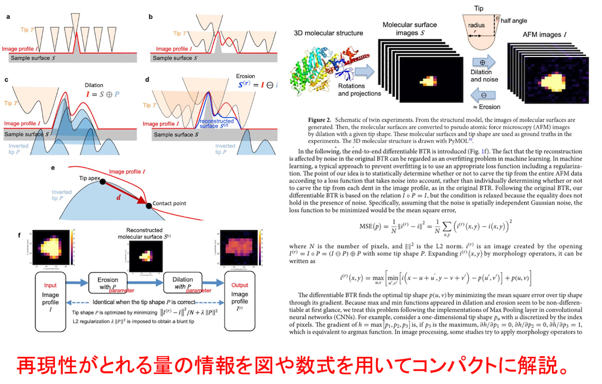

# 論文紹介の仕方 (卒研生向け)

**松永康佑**  
ymatsunaga@mail.saitama-u.ac.jp  
2024年11月3日更新  

---

## 論文とは？

- 研究者間のコミュニケーションツールとして最もよく使われるもの
- この200年〜300年(?)の間メインのツールとして利用されてきており、**型（構成）が確立している**
- 学術雑誌に投稿して、他の研究者が審査する過程（査読 Peer Review）を経て、採択されたら出版される

## なぜ論文紹介をするか？

- **論文の型（構成）を知る**。科学のお作法を知る
- **自分が卒論を書く時にどのような構成で書けばよいのか学ぶ**
- 「科学技術英語」2単位のため
- 理系の学生として、理系のメインコミュニケーションツールである論文とは何かを知る
- 院進の人は、口述試験、面接試験のため
- パワーポイントの使い方の学習
- プレゼンの練習。専門的知識を他の人へどう伝えるか？
- 専門的知識を得ること自体は、今回は優先度は低い

## 論文の「型（構成）」

1. 概要 (Abstract)
   - 概要はその論文の内容を簡潔に説明したもの。この概要の文章だけがネットに出回る。世界中の研究者は論文本体ではなくこの概要だけを読むことが多い。したがって概要は最も重要。短い時間で内容全体がわかるように**自己完結していなければならない**。
2. イントロダクション (Introduction)
   - 背景知識を説明して、先行研究を紹介しながら、**自分の研究が重要であることを読者に納得させる**。提案手法の独自性や新規性も説明する。最後に論文全体の構成を述べる。
3. 方法 (Methods)
   - 数式や図を使用して、手法などをコンパクトに説明する。**過不足なく再現性が取れる情報を過不足なく書く**。
4. 計算結果と考察 (Results and Discussion)
   - 結果を図を一枚一枚説明しながら、それぞれの結果の自分なりの解釈(どうしてそうなったか)で書いている
5. おわりに (Concluding Remarks)
   - 今回の研究内容と結果をコンパクトに、また今後の波及効果（展開）について。

## 各セクションのポイント

### 概要

以下、Y. Matsunaga, et al., *Sci. Rep.* **13**, 129 (2023) よりCCで引用

### イントロダクション

### 方法 (Methods)

### 結果 (Results)

### 考察 (Discussion)

## 論文を読む上でのポイント

- 概要 (Abstract) が最も重要。ゆっくり読む
- イントロダクションと手法は勉強として読む。
  - 何が重要か？
  - 何が問題なのか？
  - この研究の何が新しいのか？
  - 手法のアイデアは何か？
- 結果は図が理解できれば良い。著者の解釈は話半分程度で良い。
  - 著者の解釈は先入観が入っていることがあるため、図・結果が全て。

## 読むテクニック

- パラグラフライティングを意識して読む
  - 論文はパラグラフライティング = 1つのパラグラフに1つの話題
  - 大抵、パラグラフの最初の文に言いたいことが書いてある
- 翻訳サービス、生成AIは使ってもよい
  - DeepL、Google Translate、ChatGPT, Claudeなど
  - 英語にハードルを感じると思いますが、何本か読んでくると論文を読みこなす上では実は英語は問題でなく、科学的知識が一番重要であることに気づきます
- わからなくてもとりあえず最後まで一気に読み通そう
  - 一度止まってしまうと、ずっとそこで止まったままになってしまいます
  - わからなかった箇所は読み通した後で振り返る

## 余裕があれば Supporting Information を読もう

- 近年の研究手法はどんどん複雑化しており、普通の論文のフォーマットだとページ数がとんでもないことになる
- 細かな計算の条件は論文本体ではなく、論文のホームページに付録として置いてある「Supporting Information」に書いてある
- 手法の細かな内容を知るにはSupporting Informationを読む必要がある
- 全部読む必要はない。実験条件・計算条件で気になった箇所のチェックに読む程度でOK。

## わからなかった箇所の調べ方

- その箇所の関連で引用されている他の論文を読んでみよう
  - ただし、きりがないので、該当論文の必要な箇所だけ読む
- ChatGPTやClaudeに聞く
- 先輩に聞く
- 教員へ聞こう。遠慮することはありません。そのための学費です

## 論文の探し方

- Google Scholar を使おう
- 商用誌はPDFが取れないことがある。オープンアクセスの論文は無料でPDFが取れる。
- プレプリントサーバから探す
  - 査読を通過する前の論文の置き場所。全て無料だが査読を経ていないので注意が必要。
  - [arXiv](https://arxiv.org)
  - [bioRxiv](https://www.biorxiv.org)

## 論文管理

- 文献管理アプリで管理しよう
  - Zotero か Paperpile がおすすめ
  - iPad版もあるので、iPadで読むことができる
- 教員は Zotero を使用しています
- Word等での論文執筆の際に、参照文献リスト作成で威力を発揮
- 文献管理アプリに関しては以下の動画が参考になります
  - 都立大 成川先生 [文献管理ツールを使って研究の進展とアウトプットを加速する](https://togotv.dbcls.jp/en/20220806.html)

## 紹介の仕方

- **論文の型（構成）を意識して紹介しよう**。
- 紹介の流れ
  - 概要を説明 (論文の全体像。自己完結している）
  - 背景、なにが問題か？、この研究の重要性
  - 手法説明。自分で再計算できる理解度が理想。少なくとも手法のアイデアは説明できるように。
  - 結果説明。**図は全て説明しよう** (図を貼り付けるだけでも構いません）
  - 著者らの解釈の紹介は間違っていたり、先入観が入っていることが多いのでそこそこで良い。図・結果が全て。
  - 展望の紹介は必須ではない

作成したらTeamsのmeetingチャネルへアップロードして共有。

ファイル名は `日付8桁_論文紹介_論文題名一部_発表者の名前.pptx`

例） `20230624_論文紹介_DeepTICA_松永.pptx`

## 紹介のためのスライド作成

- 論文紹介ではスライド作成に時間を使う必要はない
  - 極端な話、スライドを作らずに論文のPDFを直に見せながらの紹介でもかまわない。(自分の言葉だけで説明できるならば)
- スライドへは必要な箇所だけを英語のままスクショして作っても良い。特に結果の図は図を貼り付けるだけで構わない。
  - 一方で、自分の研究のスライドは丁寧に時間をかけて何度もブラッシュアップして作成。
- スライドを作る際には、[研究室で用意しているスライドテンプレート](https://github.com/matsunagalab/slide)を使おう。
- PoiwetPointの使い方に関しては以下の動画が参考になります
  - 早稲田大学 早水先生 [PowerPointスライド作成実演ライブ ①必修編](https://www.youtube.com/live/zMp3BrIakOY?feature=share)

